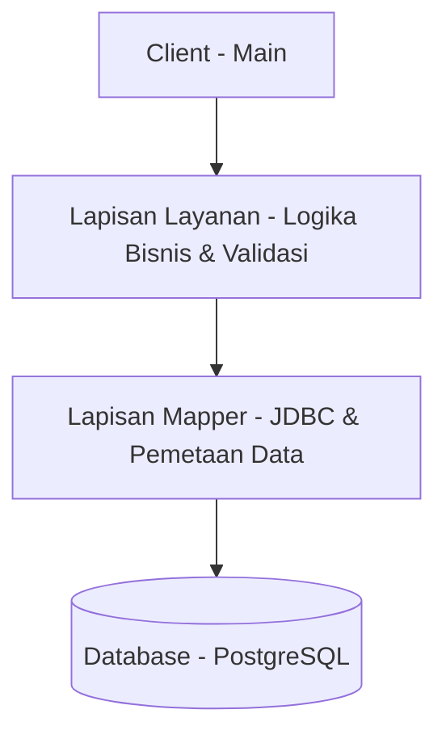

# Template Java Data Mapper - Fondasi Profesional

Template proyek Java yang modular dan bersih untuk mendemonstrasikan integrasi **JDBC**, **Java Collection Framework (JCF)**, **Inheritance**, dan **Pola Data Mapper**. Template ini dirancang sebagai fondasi tingkat engineer yang bersifat domain-agnostic untuk membangun sistem backend yang terstruktur dan mudah dikembangkan.

## 🔄 Gambaran Alur Data

Alur ini memastikan **pemisahan tanggung jawab (separation of concerns)** yang ketat, memungkinkan setiap lapisan berkembang secara independen tanpa memengaruhi bagian sistem lainnya.

---

## 🔧 Contoh Pengembangan (Extensibility)

Arsitektur ini dirancang agar sangat mudah dikembangkan. Untuk menambahkan entitas domain baru (misalnya, `Product`), Anda hanya perlu mengimplementasikan:

1. **`Product`**: Mewarisi `BaseEntity`.
2. **`ProductMapper`**: Mengimplementasikan `BaseMapper<Product>`.
3. **`ProductService`** (Interface) + **`ProductServiceImpl`** (Implementasi).

**Tidak ada perubahan yang diperlukan pada kelas inti yang sudah ada**, mendemonstrasikan Prinsip Open-Closed.

---

## ⚖️ Pertimbangan Desain (Trade-offs)

Proyek ini sengaja menghindari framework tingkat tinggi seperti Hibernate atau Spring Boot untuk:
* **Menjaga kontrol penuh** atas eksekusi dan optimasi SQL.
* **Mendemonstrasikan pola Data Mapper** dalam bentuknya yang paling murni.
* **Memperkuat pemahaman** tentang dasar-dasar JDBC dan pemetaan objek-relasional.

---

## ⚠️ Batasan Saat Ini & Pengembangan Mendatang

* **Connection Pooling**: Saat ini menggunakan strategi koneksi tunggal; dapat ditingkatkan menggunakan HikariCP untuk penggunaan produksi.
* **Manajemen Transaksi**: Implementasi dasar; belum memiliki manajer transaksi khusus bergaya `@Transactional`.
* **Logging**: Menggunakan `System.out/err` standar; sebaiknya dimigrasikan ke SLF4J/Logback untuk logging profesional.

---

## 🚀 Cara Penggunaan

1. **Skema**: Terapkan `schema.sql` pada instance PostgreSQL Anda.
2. **Konfigurasi**: Perbarui `config/DatabaseConfig.java` dengan kredensial database Anda.
3. **Build**: Gunakan `mvn compile` (memerlukan Maven).
4. **Jalankan**: Eksekusi kelas `Main` untuk melihat demonstrasi fondasi profesional dalam Bahasa Indonesia.
