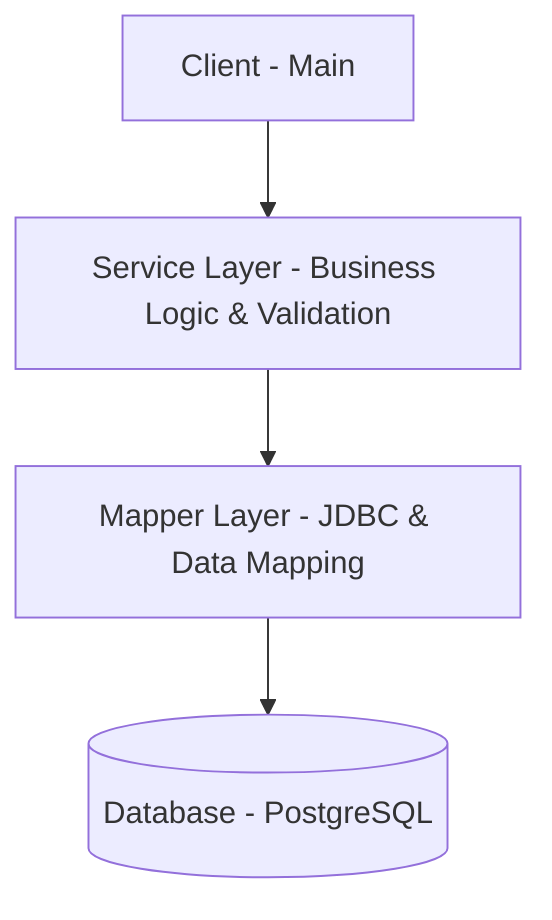

# Java Data Mapper Template - Professional Foundation

A clean, modular Java project template demonstrating the integration of **JDBC**, **Java Collection Framework (JCF)**, **Inheritance**, and the **Data Mapper Pattern**. This template serves as a domain-agnostic, engineer-level foundation for building structured and extensible backend systems.

## 🔄 Data Flow Overview

This flow ensures strict **separation of concerns**, allowing each layer to evolve independently without impacting the rest of the system.

---

## 🔧 Extensibility Example

The architecture is designed to be highly extensible. To add a new domain entity (e.g., `Product`), you only need to implement:

1. **`Product`**: Extends `BaseEntity`.
2. **`ProductMapper`**: Implements `BaseMapper<Product>`.
3. **`ProductService`** (Interface) + **`ProductServiceImpl`** (Implementation).

**No changes are required in existing core classes**, demonstrating the Open-Closed Principle.

---

## ⚖️ Design Trade-offs

This project intentionally avoids high-level frameworks like Hibernate or Spring Boot to:
* **Maintain full control** over SQL execution and optimization.
* **Demonstrate the Data Mapper pattern** in its purest form.
* **Strengthen understanding** of JDBC fundamentals and object-relational mapping.

---

## ⚠️ Current Limitations & Future Work

* **Connection Pooling**: Currently uses a single connection strategy; could be upgraded to HikariCP for production use.
* **Transaction Management**: Basic implementation; lacks a dedicated `@Transactional` style manager.
* **Logging**: Uses standard `System.out/err`; should be migrated to SLF4J/Logback for professional logging.

---

## 🚀 How to Use

1. **Schema**: Apply `schema.sql` to your PostgreSQL instance.
2. **Config**: Update `config/DatabaseConfig.java` with your credentials.
3. **Build**: Use `mvn compile` (Maven required).
4. **Run**: Execute the `Main` class to see the professional foundation in action.
